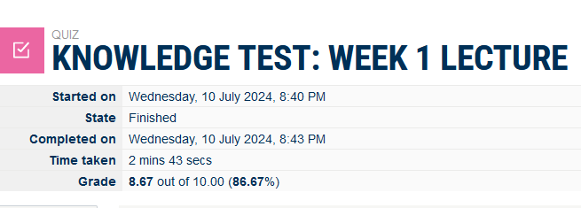
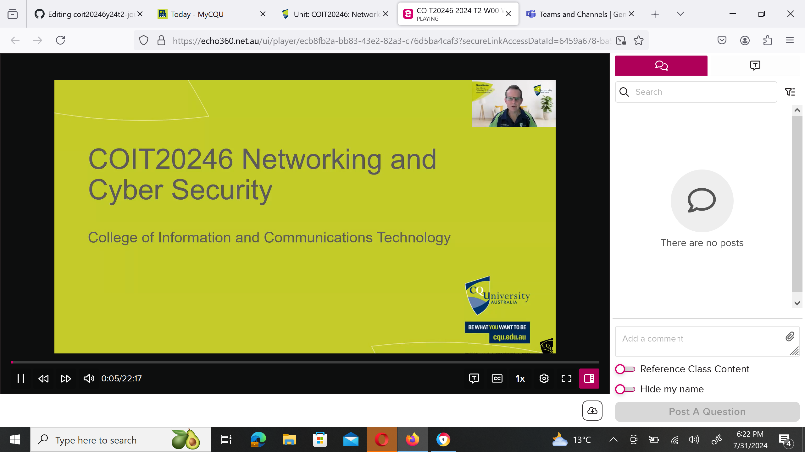
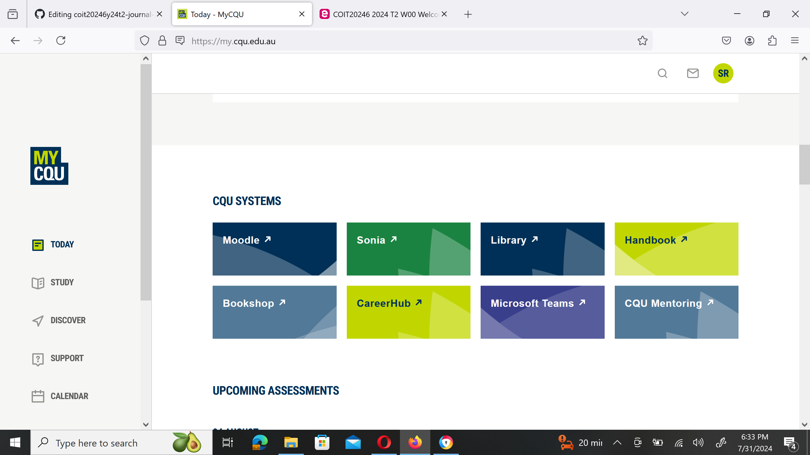
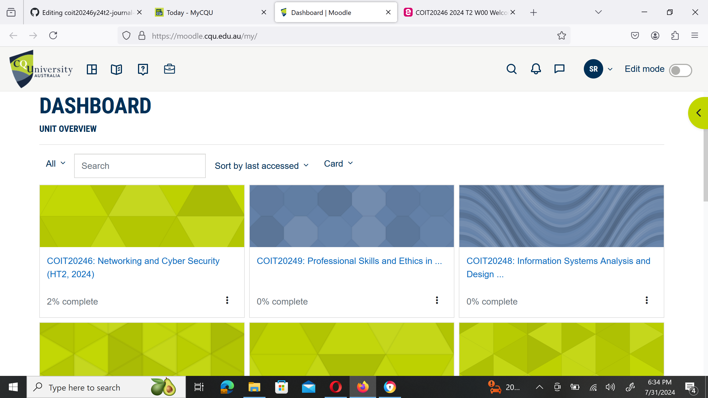
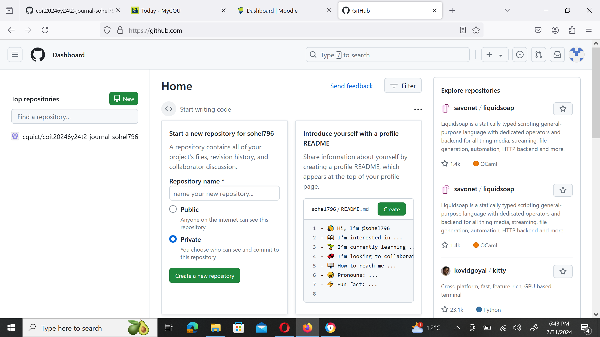
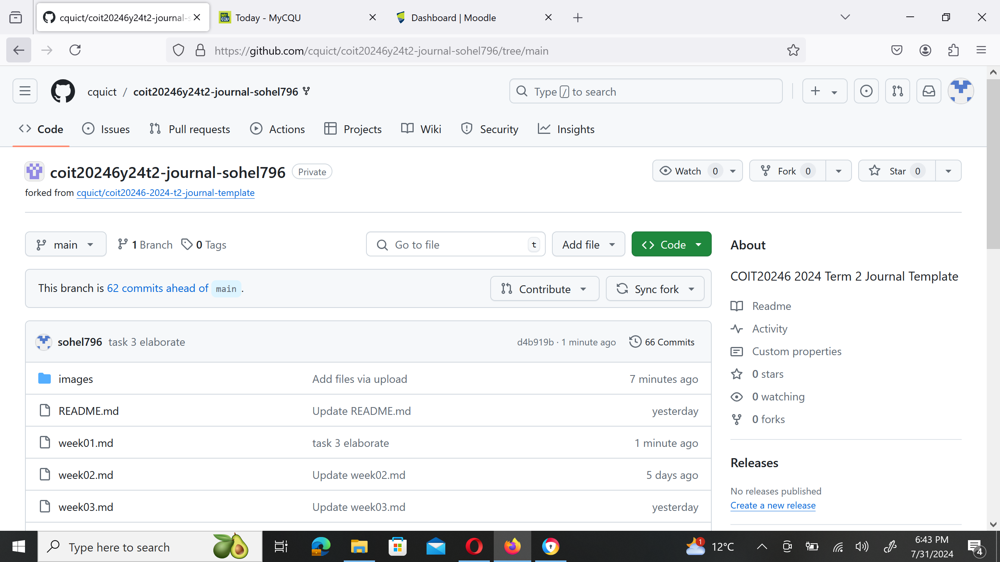
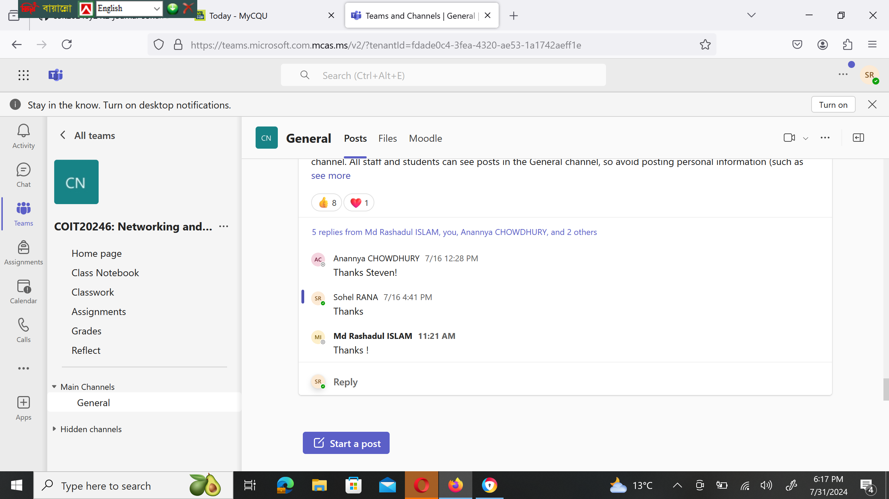

# Week 1 | Unit Introduction

## Task 1. Knowledge Test Score

The following is a screenshot of my Knowledge Test score:

## Task 2. watch the unit Video of COIT20246

I have watched the introduction video and it is very helpful for the further processing of the course.

This unit introduction video helps me to understant the Lecture, Tutorial, Unit Co-ordinator role and also what i am going to learn in this poarticular unit. The exploratoion of Moodle and it's unit introduction, learning community, Assesments and each week of study terms are briefly explained in this video here.

## Task 3. Explore the moodle site
The moodle site is very attractive in terms of iterative learning and future progress.

This is the moodle site of CQ University which is very attractive for students in terms of repetative learning. All the unit and topics are organized here and it is very efficient and convanient for learning.

All courses and topics are organized here. Apart from that this moodle is very iterative in terms of knowing the dates and time of any Assignments or Tasks, which has been not done yet by the particular students.

## Task 4. Create a Github Account
I have created my Github account using my CQU mail address and it is very easy to create this account after watching the video.

After creating the Github account i joined myself to the class using the joins class link which was provided in the moodle.

## Task 5. Write your entry for week 1 jurnal
After studying the lecture 1 a lot things i able to learn, specially the concepts of computer network which is essential for establishing communication connection in between end users. Internet Protocol addresses and others terms of networking like IPV4, IPV6 addresses, subnetting, unicasting, broadcating, anycasting, multicasting etc. As i completed my Undergraduate degree in Computer Science and Engineering so it is very iterative to me and it helps to recall my previous knowledge also.

## Task 6. Visit the Microsoft Teams Site
Leraning community of COIT20246 is very helpful and attractive. It is a great medium for helping the students and they are super active. I got my solution of one problem within a minutes, so they are giving their best and it is a great environment for asking any help regarding study problems.

here at the community i send a welcome Thanks to my unit co-ordinator after receiving his welcome instruction.

## Task 7. Reflection of My Knowledge

I have previously studied Bachelor of Computer Science and Engineering I already know various comutiong and networking trems also i have knowledge about networking and cyber security, Setting ip a Cisco router, layer three switches etc with IOS on command line etc. The studing technique of CQ university is very much iterative and Assesments are on Assignment based but it need deep learning and understanding of topics. overall the teaching system of CQ university is good and convanient.
