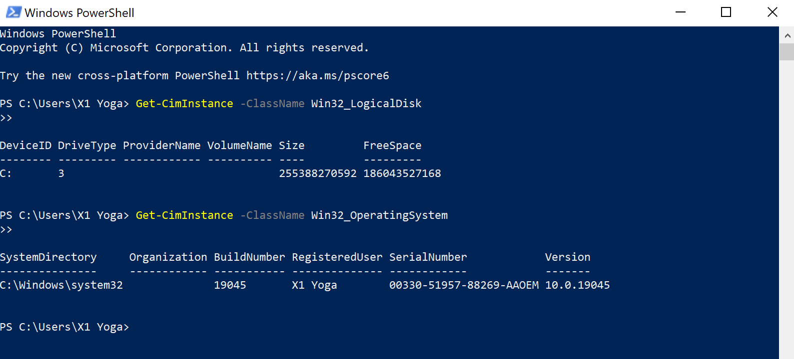

# Week 2 | Computer Systems and Applications

## Task 1. week02_Knowledge Test

The following image shows the score of week 2 knowledge test score:

## Task 2. View Computer Information

   
   ### Viewing CPU Information
   
   Here in CPU information viewing it shows my Device name which is CPU0, and caption as Intel(R) Core(TM) i7-8650U CPU @  1.90GHz Intel64 Family 6 Model 142 Stepping 10 2112 with the maximum clock speed socket desstination U3E1.
   

   ### Viewing RAM information

   Here in powershel it shows my CPU's total memory size which is 17011671040 bytes. For viewing this memory information i use the powershell command Select-object TotalPhysicalMemory.
   
   
   

   ### Viewing Disk Size Information
   
   
   For getting the Disk information using powershell i have use this command which is Get-CimInstance -ClassName Win32_LogicalDisk. as a result it shows the total disk information or size of my CPU. Here my drive type is 3, and total size of my disk is 255388270592 bits and total free space are availabe is about 186043527168 bits.
   

   ### Viewing OS versions
   
   
   To get information about the operating system version i used this command Get-CimInstance -ClassName Win32_OperatingSystem
here it shows:

1)Built number which is 19045 

2)Registeruser is X2 Yoga

3) Serial number:  00330-51957-88269-AAOEM
   
4) OS version: 10.0.19045
   

Also here we can see the current operating system name that i am using which is Microsoft Windows 10 pro.

## Task 3. Deploy Linux Web Server in virtual Box

Deploying VirtualBox and downloading the Linux ISO are the first steps in setting up a virtual machine (VM), installing Linux, configuring settings, configuring the web server (Apache/Nginx), and testing the system with a browser.

Karnel Loaded:
Linux 5.10.161
By using the command uname -a

## My knowledge about Virtual Box and Open WRT

Oracle's free, open-source VirtualBox virtualization technology enables us to run several operating systems on a single physical computer. It includes many networking choices, cross-platform compatibility, cloning and snapshot features, and guest enhancements for improved performance.

For embedded devices like routers, OpenWrt is an operating system based on Linux. It employs the opkg package manager, is extremely configurable, has sophisticated networking features, and has an easy-to-use web interface (LuCI) for administration.

## AI description of Virtual Box and Open WRT

VirtualBox is a free, open-source virtualization platform by Oracle that allows you to run multiple operating systems on one physical machine. It supports cross-platform use, provides snapshots and cloning capabilities, and offers various networking options and guest additions for enhanced performance.

OpenWrt is a Linux-based OS for embedded devices like routers. It is highly customizable, supports advanced networking features, uses the opkg package manager, and provides a web interface (LuCI) for easy management.

The Linux oeb server is deployed in VirtualBox 

## Task 4. Browse to OpenWRT Websites

Values about OpenWRT System:

1. RAM - 128 MB
2. Number of PC's -1
3. Storage - 120.5 MB
4. OS version- OpenWRT 22.03.3 r20028-43d71ad93e
5. kernel version- 5.10.161

## Reflection of week 02

I examined the CPU, RAM, disk size, and operating system version of the system using PowerShell. The kernel version was 5.10.161 when I installed a Linux web server using VirtualBox after that. Routers equipped with a web interface can personalize the OpenWrt Linux operating system, and VirtualBox allows for the installation of many OSs. the OpenWrt standards mentioned below, in final order: RAM of 128 MB, storage of 120.5 MB, and kernel 5.10.161.

