## Week 03 Tutorial

## Task 01 Knowledge Test

The following is a screenshot of my knowledge Test Score:

## Task 02 : View your Addresses

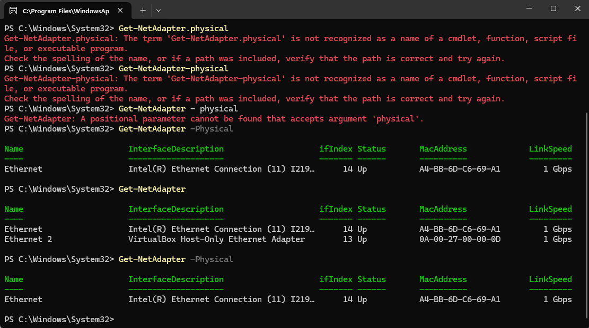

Here in task 2 it shows the various connection types and for getting those i used the command:

## Get-NetAdapter 
it shows that my pc is connected to two networks, one is through Ethernet and other one is Ethernet 2. In Ethernet it is connected physically but with Ethernet 2 it is connected Virtually. For getting the more details about the connected type i used the command:

## Get-NetAdapter -Physical
It shows the below details-

For Ethernet-
1)IfIndex Status: 14up
2) Mac Address: A4-BB-6D-C6-69-A1

and For Ethernet 2:

1) IfIndex Status: 13up
2) Mac-address: 0A-00-27-00-00-0D
3) LinkSpeed: 1Gbps

It shows the physical connection status like:
1) IfIndex status: 14up
2) Mac Address: A4-BB-6D-C6-69-A1
3) LinkSpeed: 1Gbps

## Task 03 : Ping your local router

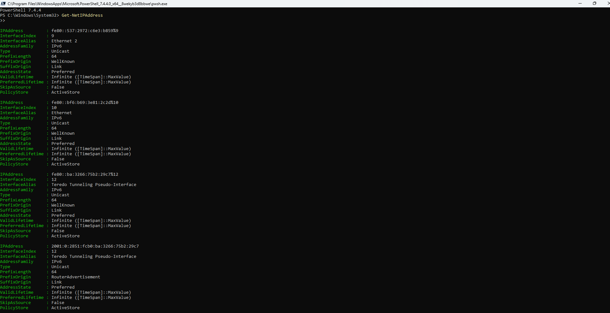

My PC is connected to other networks, one via Ethernet and the other using Ethernet 2. Ethernet allows for a physical connection, but Ethernet 2 allows for a virtual connection.

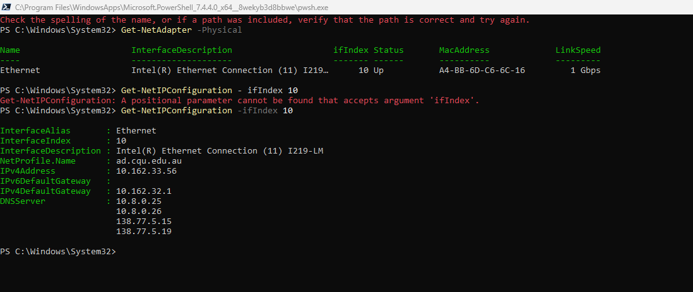

here i am giving the command:

## Get-NetIPConfiguration -ifIndex 10

By using this command in powershell i want to see the details of InterfaceIndex number 10 which is InterfaceAlias "Ethernet" connection details.like-
1) IPv4 Address: 10.162.32.1
2) IPv4 Default Gateway: 10.162.32.1
3) DNS Server: 10.8.0.25
   
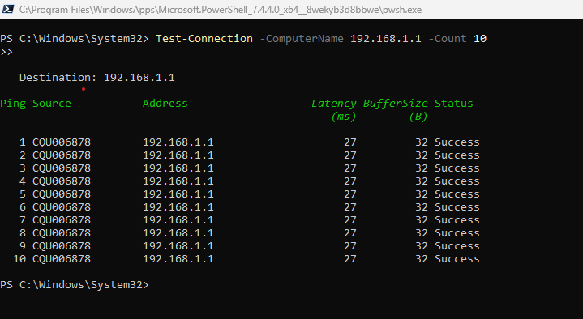

Here, i try to ping my local computer to another one, and tried to see that is they are able to make any connections or not?
For this i used the command-
## Test-Connection 192.168.1.1 -count 10

here, at first my computer will try to connect with the destination IP address 192.168.1.1. After the connection establishment i give the command to transfer 10 data packets to 192.168.1.1
when it finished the transfering it shows the below details-
1) Ping source: CQU006878
2) Addresses: 192.168.1.1
3) Latency(ms) : 27
4) BufferSize: 32
5) Status: Success

## Task 04 : Ping your OpenWRT Linux Server

For pinging my openWRT linux with windows powershell, at first i run a command: 
### Test-Connection -count 3 www.facebook.com
and it shows that 3 data packets has been transfered.

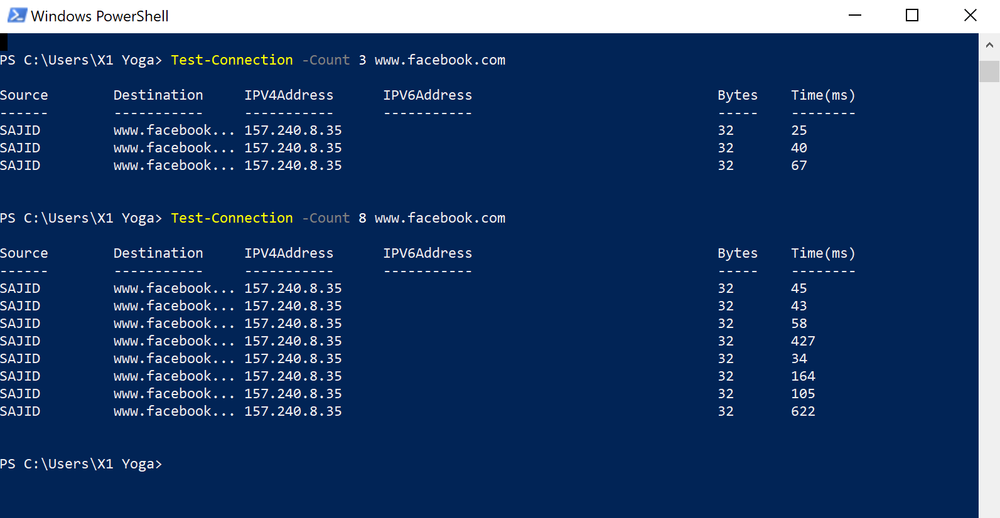

After that i went for VirtualBox VM machine where i run my linux server and i put the command:
### tcmdump -i eth0 -n -w myping.pcap 'arp or icmp'
via using this command i put the instruction to download myping.pcap file. here in bellow screenshot you can see that.
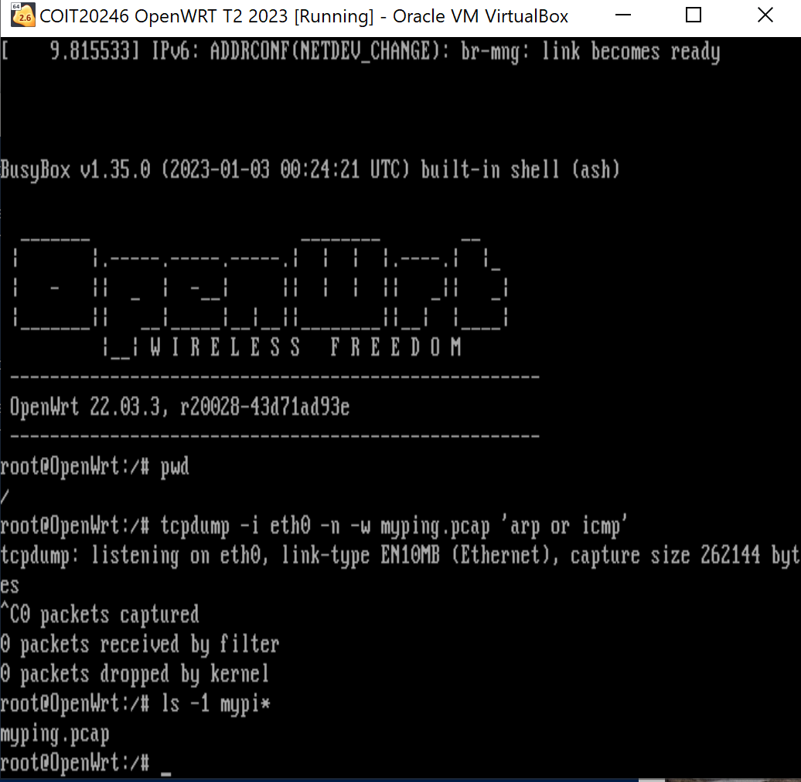

Then i went to filezila and tried to trace my downloaded myping.pcap file. below you can see that..
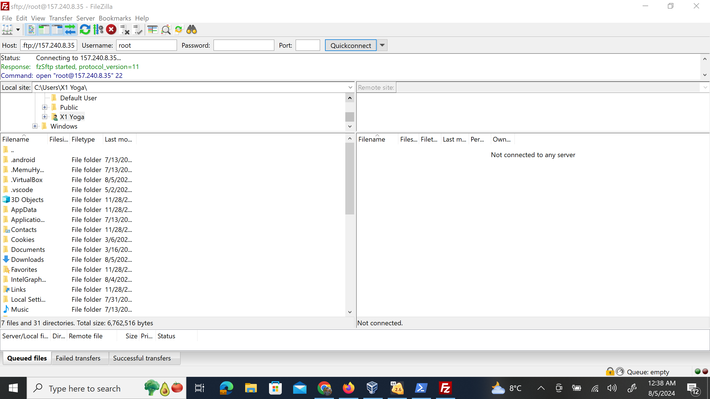

## Task 05 : Academic Integraty Policy

The following is a summary of CQUniversity's Student Academic Integrity Policy: 
1) Scope: This policy covers all current and former students, with the exception of research integrity and other policy breaches.
2)  Breaches: This policy covers inappropriate conduct (Level 1) to serious misconduct (Level 5), which is assessed by misconduct type, impact, intent, and effect.
3)  Revocation: This policy is delayed until the end of the appeal period or until the Academic Appeals Committee review.
4)  Reporting: Unlawful conduct is reported to authorities, and contract cheating is reported to TEQSA.
5)  Procedural Fairness: This policy ensures that academic integrity is promoted, managed, and reported in a timely manner.
6)  Records: These are managed in accordance with University policies and retention schedules.
7)  Definitions:  Include terms for academic credit, integrity, and decision-making processes.

   
## Task 06 : Print Github journal Page to PDF

I have downloaded the pdf file of week 03.

[pdf](https://github.com/sohel796/pdfviewer/blob/main/week03.pdf)

## Task 07 : Find Addresses of a website

For finding any website i use the powershell command:
### nslookup www.facebook.com
this command i used for finding out the official website of a popular social media Facebook.com. 

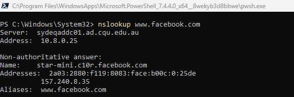

Here, it shows the addresses of-
Server: sydeqaddc01.ad.cqu.edu.au
Address: 10.8.0.25

## Task 08 : Home Internet Connection

For testing my home internet connection i took the help of two most popular website help which are Speedtest.com and fast.com. I did this speed Test at the afternoon.
At first i will discuss the details what i get from the test result of speedtest.net website.

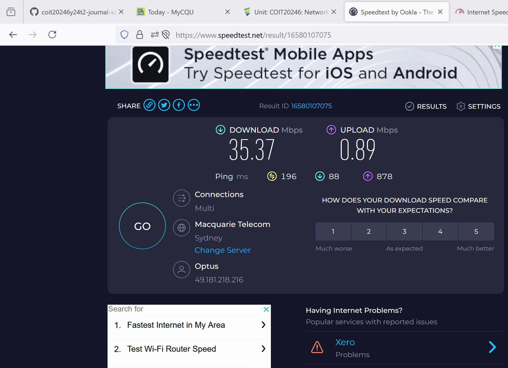

Here, it shows my router details:

1)Name: Optus

2)Connections: Multi

3)Download mbps: 35.37 mbps

4)Upload Speed: 0.89 mbps

so, after the analysis it shows that the Download speed is more that upload speed.

Now let's see the test result details from Fast.com

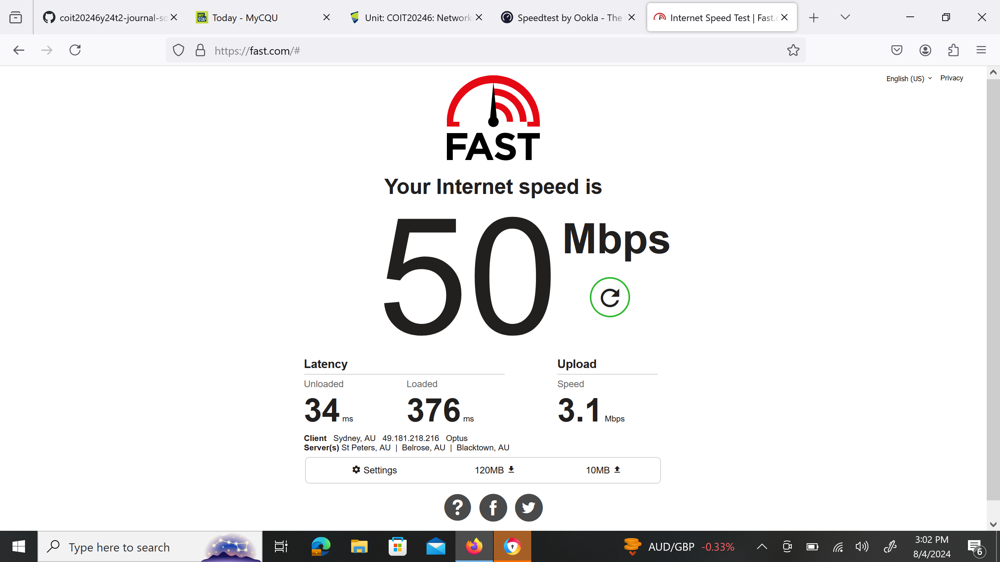

Here, it shows my router details:

1)Name: Optus

2)Connections: Multi

3)Download mbps: 120 mbps

4)Upload Speed: 10 mbps

5)Latency: Unloaded: 34ms and loaded: 376 ms

6)Server: st peters, AU

so, after the analysis it shows that the Download speed is more that upload speed.

### secondly i tried to find out my internet speed at the night

At the night time i test my internet speed via using the Fast.com website and find out this result:

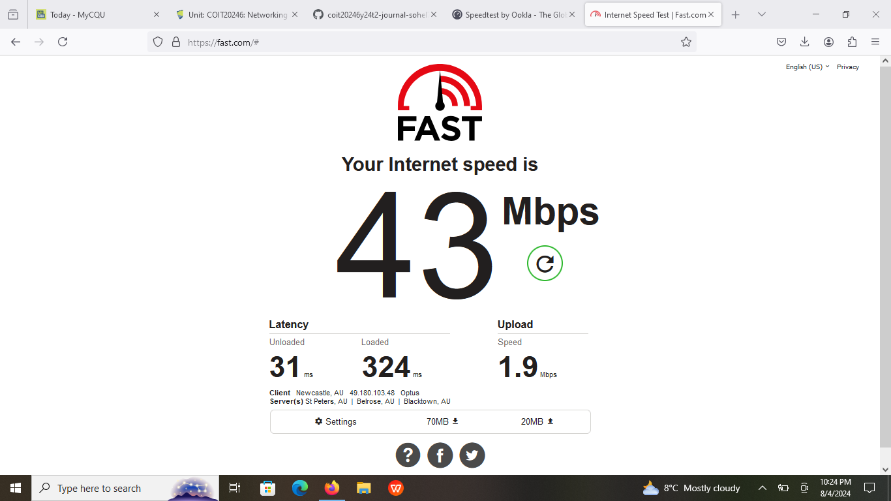

Here, it shows my router details:

1)Name: Optus

2)Connections: Multi

3)Download mbps: 43 mbps

4)Upload Speed: 1.9 mbps

5)Latency: Unloaded: 31 ms and loaded: 324 ms

6)Server: st peters, AU

so, after the analysis it shows that the Download speed is more that upload speed, and also the latency of loaded is more than unloaded.

## Reflection of Week 03

At first in this particular week i went through the weekly knowledge test, after that i learned how to view my computer addresses via using windows powershell and it's useful commands. Then i learn how to ping my computer to another device and for doing so which commands are necessary,and after pinging how to transfer data packets. Another important term i used to learn in this week is how to ping the windows powershell with Linux machine, and how to transfer data in between of them. In this week the most interesting term that i learn is that how to download a random pcap file in linux and how to decode that pcap file using Filezila and able how to view that pcap file using the help of wireshark software. In one particular task i able to be aware of the CQ university academic integrity and student policies also. Finding out any website IP address in windows powershell taught me a good lesson with the command nslookup i complete this task. Internet is the most common and useful part in our day to day life, and it's speed is also a concern. In task 8 i able to learn how to view my home internet conncetion speed, and i am surprised when i just saw that the internet speed varies time to time. I did the speed test in two different times of a day and saw that the speed of download and upload is varring in different times.
