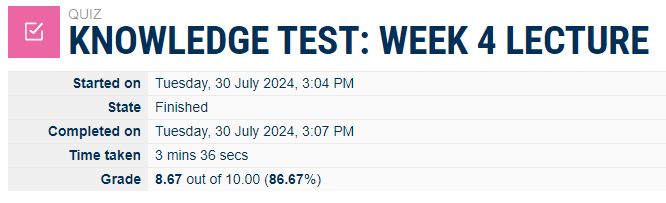

## week04 Tutorial

## Task 01 Knowledge Test

The following is a screenshot of my knowledge Test Score:

## Task 02 Project Initiation

For doing the Network project we formed a group of two people named:
1) Sohel Rana ID:12272262
2) Shakir Uddin Ahmed ID: 12283362

URL of our project Reprository:  [Project Reprisorotory](https://github.com/orgs/cquict/teams/syd-shakir-sohel) 

## Task 3: Draw Network Diagrams

[This is the draw.io file of switch lan a](images/switch-lan-a.drawio)

[This is the draw.io file of switch-lan-b](images/switch-lan-b.drawio)

## Task 4: Analyse Ping packet capture

This is the pcap file that i opened using wireshark, now let's have a look at this-

For the better understanding of any particular protocol like ARP. Here, it can be found four arp packets.

if we just break the packet of arp first then it'll shows us the below details-

Now let's Understand how ICMP or Internet Control Management Protocol works-

from all of those icmp packets if we just investigate the first ICMP file we get the below followings-

## Task 5: view arp Table

For viewing the ARP table i used the command-
# arp -a
so that it shows me all the network addresses that are being connected with my network. like here i found two different network with IP addresses 192.168.0.146 and 192.168.56.1

test ping

For testing the ping i use ping command with a IP address or any domain name like- 
Ping 192.168.1.1 or
ping www.google.com

## Reflection of Week 4

This particular week at first i went through my weekly knowledge test and after that i need to form a group with another member for the upcomming network project, also create the project github repriogotory. I draw some network diagrams in task 3 according to the requirments also analyze the ping packet capture file of previous week and how this works of protocols like ICMP and ARP protocol datagram. At the end i learned how to view the Address Resonance Protocol or ARP table by using POwershell.
