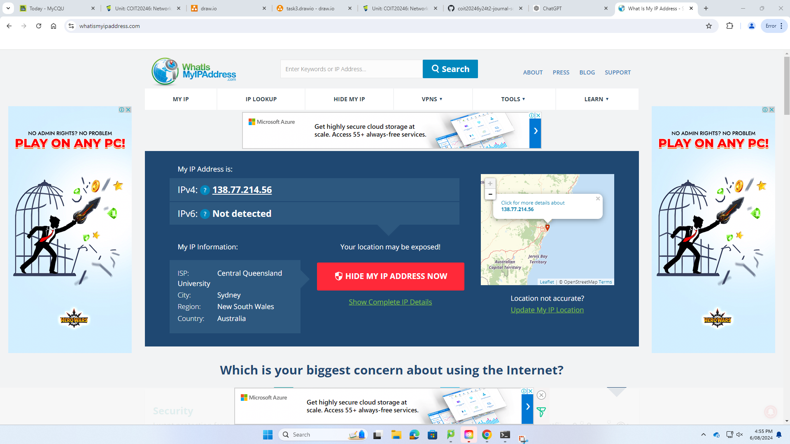

## Week 05

## Task 01: Knowledge Test

The following is the Screen Shot of my Knowledge test result:

## Task 02: View Routing Table

For viewing the Routing Table i used the command:

### Get-NetRoute

here it shows the following image-

with this perticular command once can view the ifIndex of any particular matchine with Destination Prefix or Simple Internet Protocol Address, Next hope with which IP oit is connected, also the Router Matrix, if Matrics and the policy Store. For Example-

IfIndex         DestinationPrefix           NextHop        RouteMatric              ifMetric            policyStore

10              255.255.255.255/32     0.0.0.0      256              25            Active Store

1          255.255.255.255/32     0.0.0.0      256              75           Active Store

## Task 3:
For completing this task i took the help of the website called What is my IP address.

a) For specifying the IP addresses to the network - Router1 network i put the IP addresses as like my ID is 12272262 so i use the 4 four digit of my CQ university ID number as the first two doted decimal and create the ip address for Router 1 network 22.62.5.0
I did the same task for another lan network where i used my group partner CQ university Id like 12283362 so i make the network IP 33.62.6.0 
For the WAN network i have the freedom to choose any IP address that's why i put here 192.168.5.0

b)

here i have drawn the network diagram according to the requirments using draw.io website

c)

Now let's see the Routing Tables of each network-
Routing table for Router 1

| Destination | Next Hope | 
|----------   |-----------|
| 22.62.5.0   | Direct    | 
| 192.168.5.0     | Direct  | 
| 33.62.6.0    | R2  | 

Routing table for Router 2

| Destination | Next Hope | 
|----------   |-----------|
| 22.62.5.0   | R1  | 
| 192.168.5.0     | Direct  | 
| 33.62.6.0    | Direct | 

d)

This image shows how the ICMP packets capture and sends the data from one end to another-

## Task 4: Academic Integrity outcomes

Academic Integrity Scenario

Scenario: A student submits a paper largely copied from online sources without proper citation.

Recommendations:

Educate Yourself: Understand citation guidelines and academic integrity. Use available resources like writing guides and workshops.
Plan and Review: Start assignments early and use plagiarism detection tools before submission. Seek help from tutors if needed.
Outcome According to CQU Policy: Serious misconduct, potentially resulting in a failing grade, disciplinary action, and educational penalties. This ensures fairness and upholds academic integrity for all students.

## Task 5 : IP address Look UP

The below is the screenshot of my CQ University Computer Lab PC's IP identification with some related informations like:
1) IPv4 address is 138.77.214.56
2) IPv6 is not detected.
3) Internet Service Provider (ISP) is Central Queensland Universuty
4) City: Sydney
5) Region: New South Wales
6) Country: Australia

Now let's see the IP details of my Home PC's. Here it identifies the below information about my home Internet Protocol(ip) address:

1) IPv4 address is 49.181.17.54
2) IPv6 is not detected.
3) Internet Service Provider (ISP) is SingTel Optus pty Ltd
4) City: Sydney
5) Region: New South Wales
6) Country: Australia

## Reflection of Week 5
In this particular week i completed my knowledge test first and after that i learn about how to view my neighbour ip addressess with some specifications like Next Hope, Route Matrix, If matrix, policy store etc.
