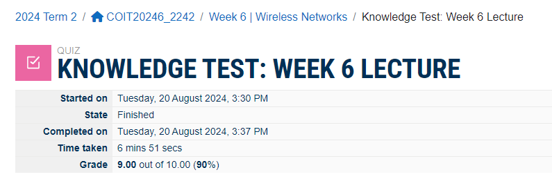
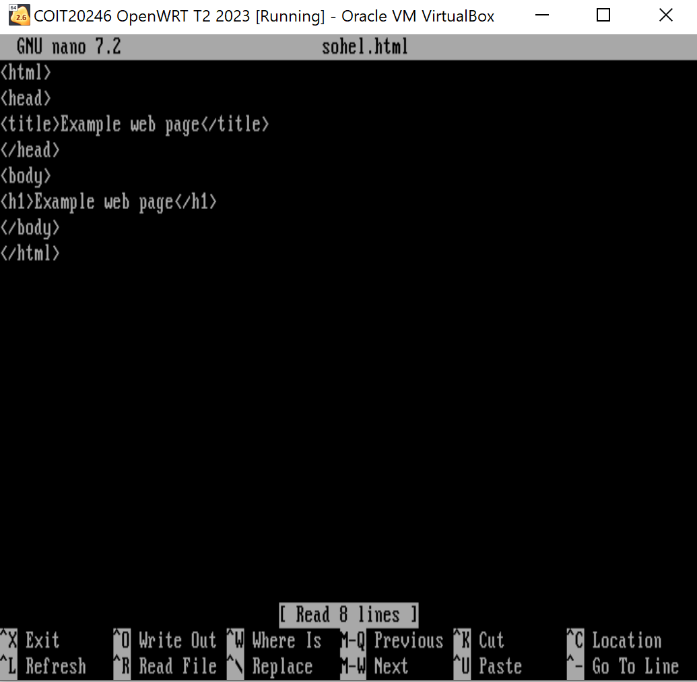
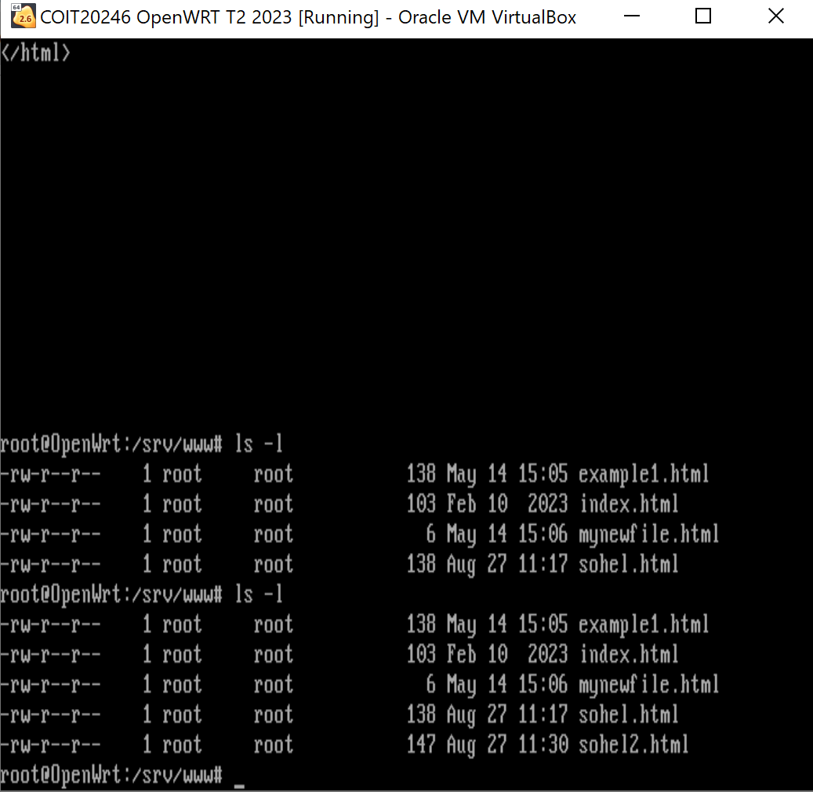
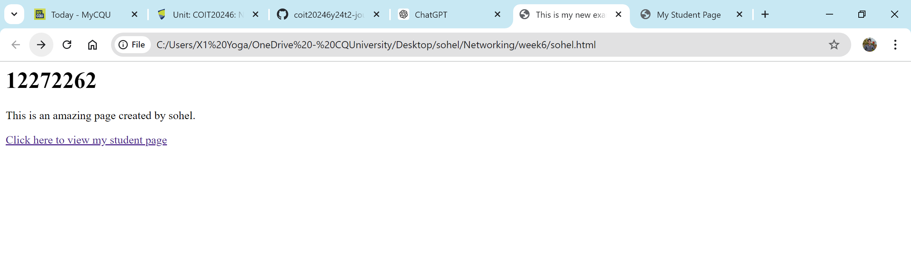
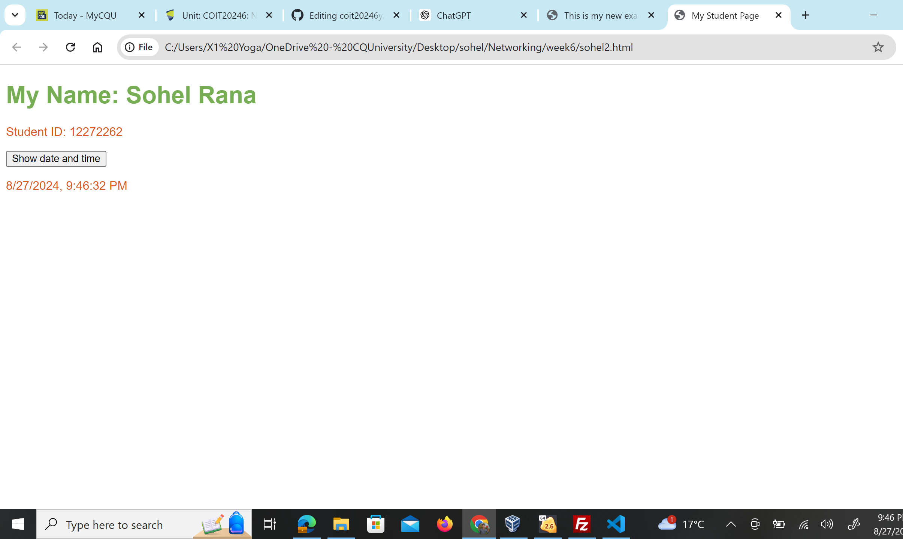
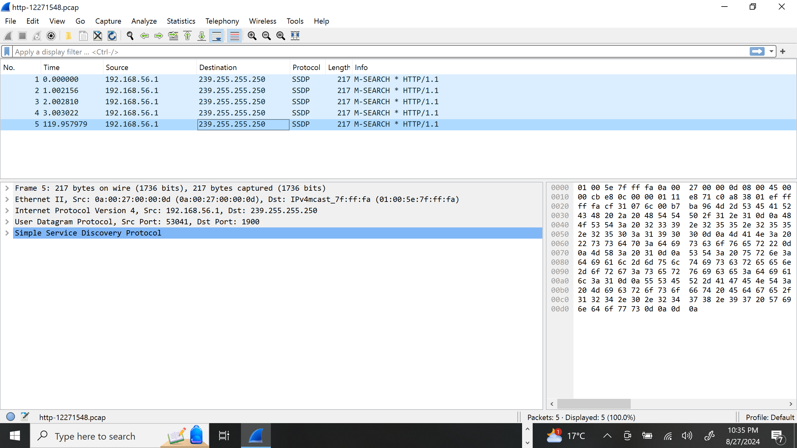
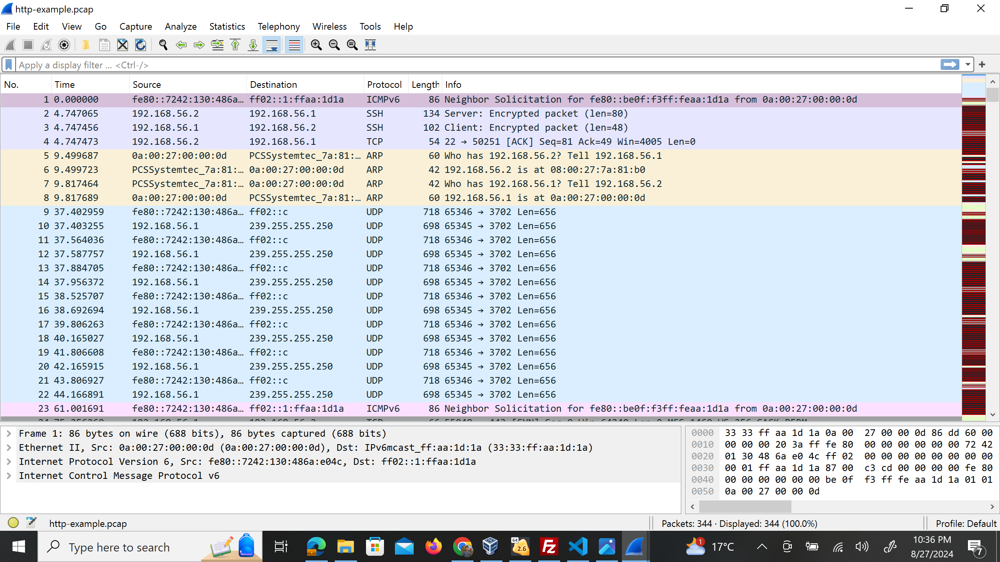
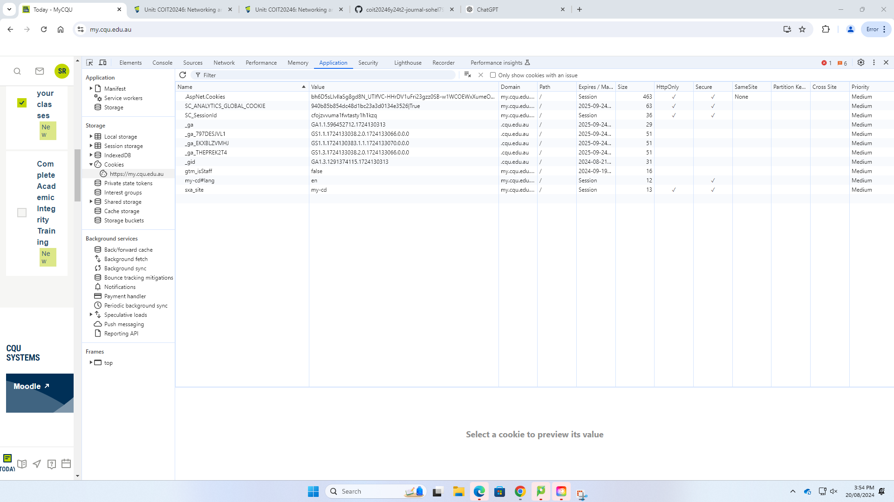

## Week 06

## Task 01: Knowledge Test

The following is the Screen Shot of my Knowledge test result:

## Task 2: Create web page in open WRT

For creating web pages in open WRT at first i have to run virtual machine at my windows computer. Later on i put the command cd/srv/www after that i see my directory with the command: cd/srv/ pwd . here i can see my created sohel.html file in virtual linux machine.

i have create two different pages for doing this task and below you can see all of them in virtual linux machine-

when i open my first page in any web browser like google crome then it show the below details with my other page link.

from the first sohel.html page when user click on the link then the second page is open and it shows my name and cq university id number and when user click on the date and time button below the current date and time will appear.

Now i am providing the 3 page link here-

view sohel.html file from here: 
[sohel.htmlfile](https://192.168.56.2/sohel.html)

## Task 3: Capture HTTP packet capture

using virtual linux machine i put the command tcpdump for downloading the pcap file. the below screenshot are the download packet capture files-

## Task 4: Analyze HTTP packet capture

## Task 5: View your Cookies

For viewing the cookies at first we need to inspect the web site after that from the top down menu it needs to went for the Application bar where cookies can be found.

