## Week 07

## Task 01: Knowledge Test
The following is the screenshot of week 07 knowledge test-
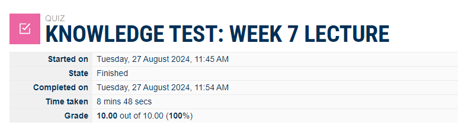

## Task 02: View WiFi Details

this is the details of my home wifi network-
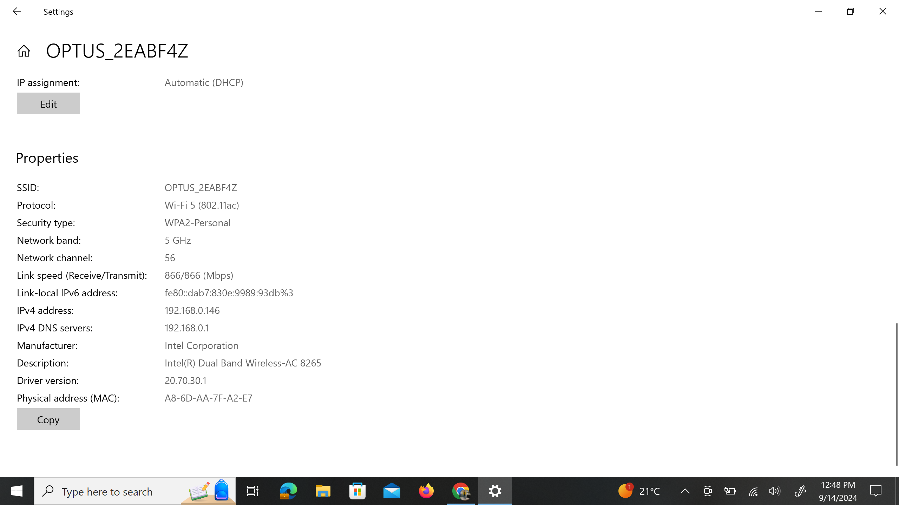

## Task 3: Use Wifi Access Point

Using Wifi access points for accessng the wireless services within the network. For doing so it needs to know the hardware or Router well. Here, for understanding the wifi access points and it's features i tried the provided simulation software as i don't have the access of my home or any other business routers.
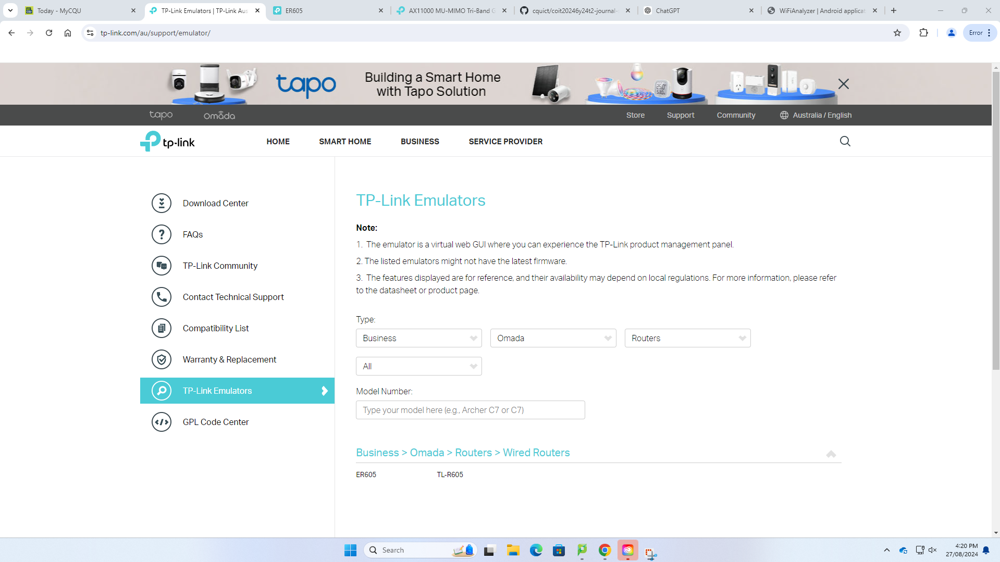

HOME rOUTER simulation
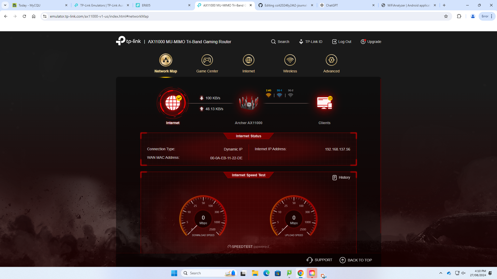

Security
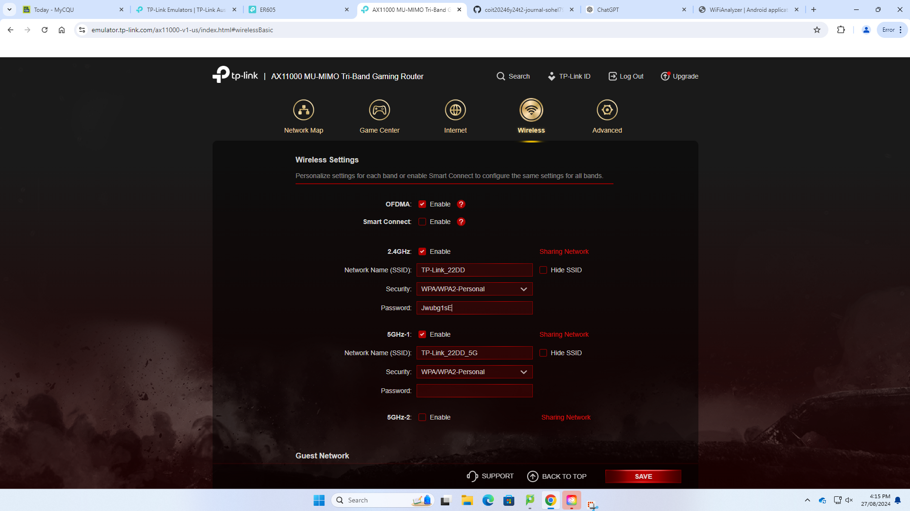

Bandthwidth
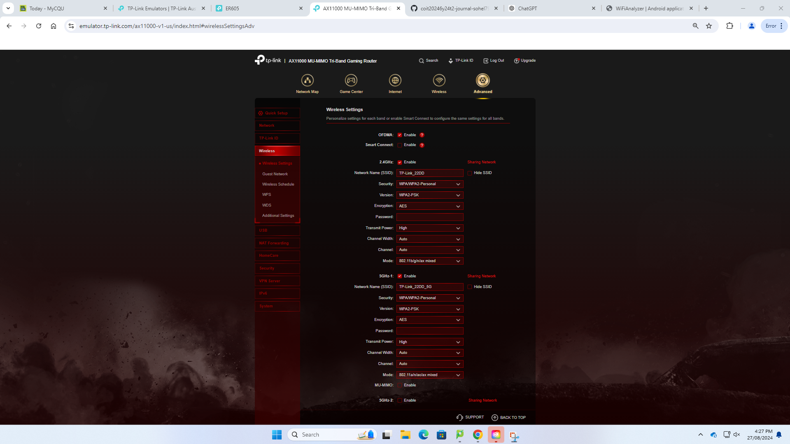

access control
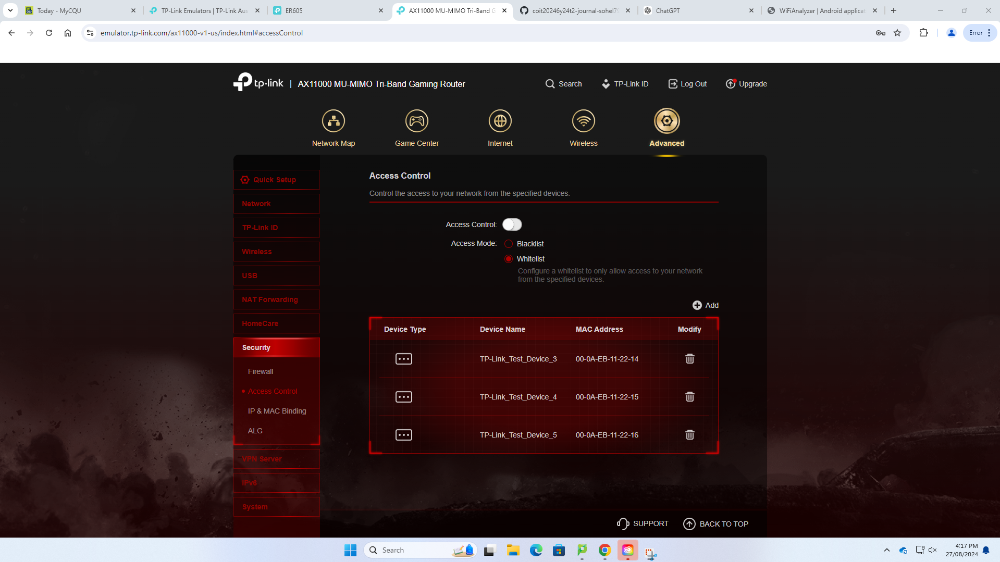

Business Router
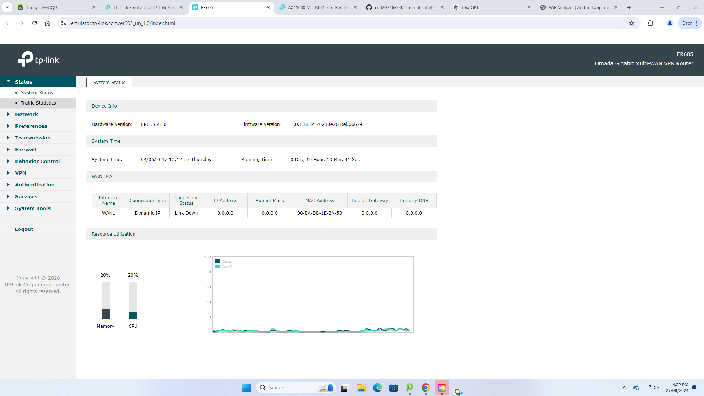

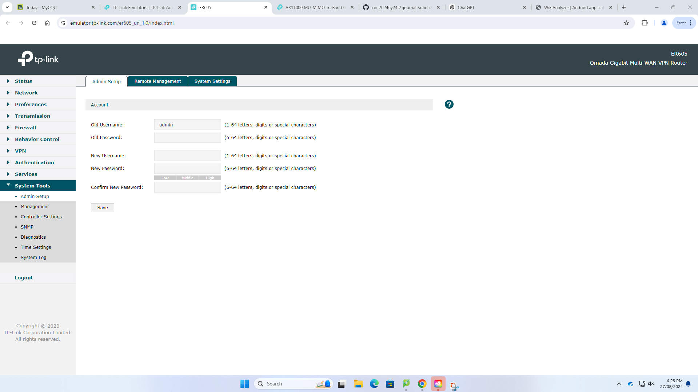

Bandwth
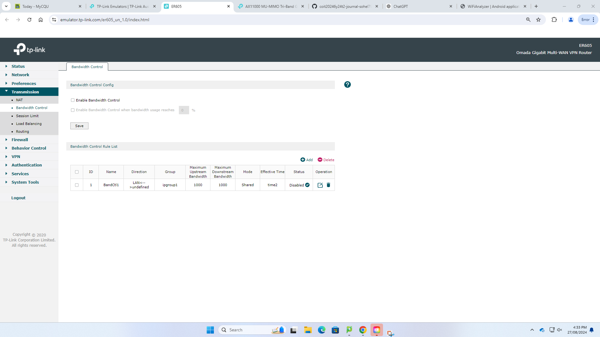

## Task 04: Self Evaluation of Team work

Here is the evaluation and contribution graph which here shows the total group members contribution for this project.

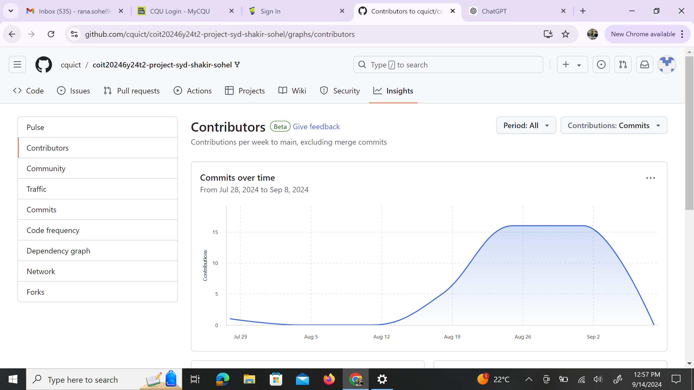

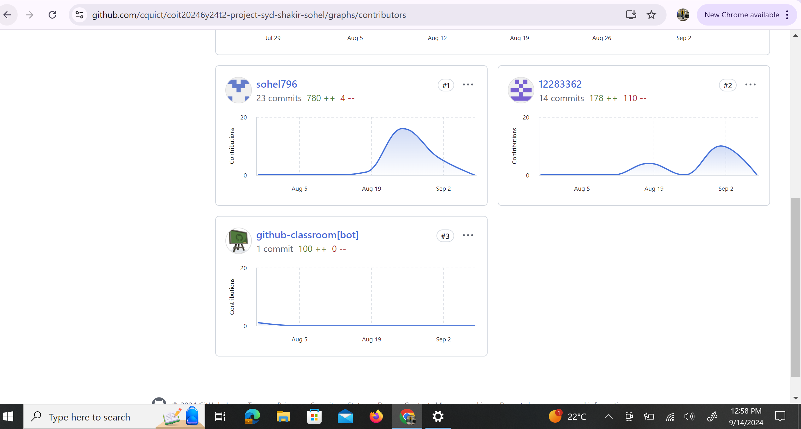

From July 28 to September 8, 2024, I stands out as the most active contributor due to several key factors. we both made 23 commits, nearly double the 14 commits from the second most active contributor, shakir, and far more than the single commit by the bot. I added 780 lines of code compared to 178 by my group partner, indicating a significant role in developing new features or enhancements. Our contributions focus primarily on adding code (+780 lines) with minimal deletions (-4 lines), suggesting a focus on expanding the codebase rather than refining it. Consistent weekly contributions further demonstrate ongoing involvement and commitment.

## Reflectrion of Week 07
